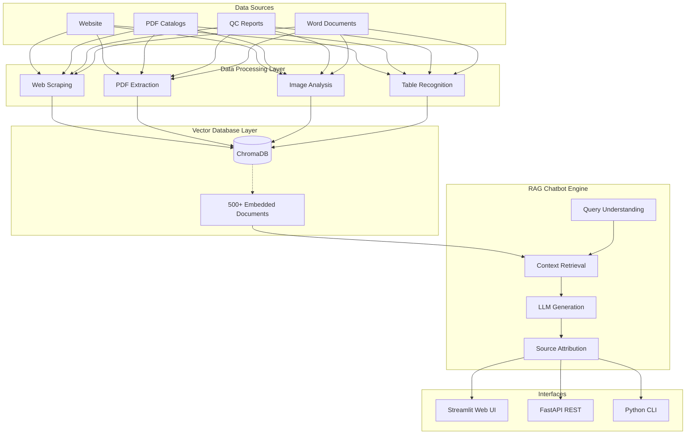

# 🌊 Oceanic6 Solutionz - Multimodal RAG Platform

A production-ready Retrieval-Augmented Generation (RAG) chatbot and platform built for Oceanic6 Solutionz. This system intelligently answers customer inquiries about granite, quartz, and related products by retrieving relevant information from website data, PDFs, and internal company documents, then generating contextually accurate responses.

## 🏗 Architecture

The platform uses a multimodal approach, handling text, structured tables, and images extracted via GPT-4o vision.



## ✨ Key Features
- **Multi-source Data Integration**: Automatically extracts and indexes 500+ documents from oceanic6solutionz.com, PDF catalogs, and specification docs.
- **Intelligent Retrieval**: Semantic similarity search with top-5 chunk retrieval and source attribution.
- **Advanced NLP**: Powered by GPT-4o with context-aware conversations and real-time streaming.
- **Production Grade**: Comprehensive error handling, detailed logging, health checks, and Docker containerization.
- **Beautiful UI**: Built with Streamlit for a seamless customer chat experience.

## 🛠 Technology Stack
- **LLM Framework**: LangChain
- **Language Model**: GPT-4o (OpenAI) / Local Mistral Support
- **Embeddings**: text-embedding-3-small (OpenAI) / all-MiniLM-L6-v2 (Local)
- **Vector Database**: ChromaDB
- **Web Framework**: Streamlit + FastAPI
- **Document Processing**: PyMuPDF, pdfplumber
- **Web Scraping**: BeautifulSoup, Requests

## 🚀 Quick Start

### 1. Prerequisites
- Python 3.11+
- OpenAI API Key

### 2. Setup
Clone the repository and run the setup script:
```bash
git clone https://github.com/Umakshi12/production-multimodal-rag-platform.git
cd production-multimodal-rag-platform

# Make sure you have created your .env file with your API keys first!
cp .env.example .env
# Edit .env to add your OPENAI_API_KEY
```

### 3. Ingest Data
Run the data ingestion pipeline to process documents and build the ChromaDB vector store:
```bash
python data_ingestion.py
```

### 4. Run the Interface
Launch the Streamlit web interface:
```bash
python run_frontend.py
```
Or directly:
```bash
streamlit run streamlit_app.py
```

## 📖 Documentation
- **[PROJECT_SUMMARY.md](./PROJECT_SUMMARY.md)**: Detailed overview and scaling considerations.
- **[API_DOCS.md](./API_DOCS.md)**: FastAPI endpoint references.
- **[DEPLOYMENT.md](./DEPLOYMENT.md)**: Docker and production deployment guides.
